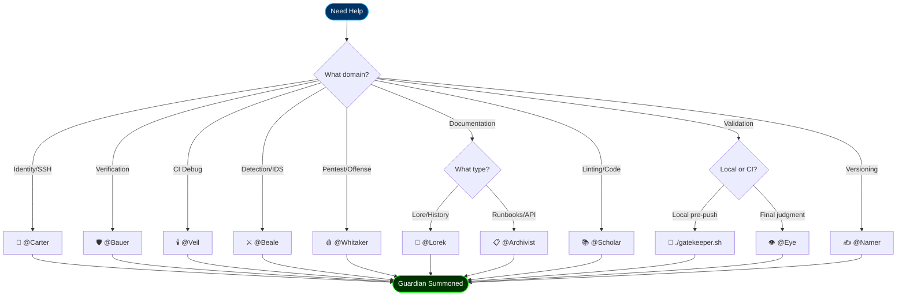

# .github/agents — The Incarnated Guardians

**Purpose**: VS Code Copilot agent definitions for the Seven Sentinels.
**Summon**: `@GuardianName <prompt>` in VS Code Copilot Chat

## The Pantheon

| Guardian | File | Sigil | Domain |
|----------|------|-------|--------|
| Holy Scholar | `holy-scholar.agent.md` | 📚 | Default enforcer, lints, PRs |
| Carter | `carter-eternal.agent.md` | 🔑 | Identity & SSH hardening |
| Bauer | `bauer-verifier.agent.md` | 🛡️ | Verification & trust |
| ↳ Veil | `bauer-veil.agent.md` | 🕯️ | CI debug diagnostics |
| Beale | `beale-awakened.agent.md` | ⚔️ | Drift detection & IDS |
| Whitaker | `whitaker-red.agent.md` | 🩸 | Offensive security |
| Sir Lorek | `sir-lorek.agent.md` | 📜 | Lore & prophecy |
| ↳ Archivist | `lorek-archivist.agent.md` | 📋 | Runbooks & API docs |
| The Eye | `all-seeing-eye.agent.md` | 👁️ | Final validation |
| ↳ Namer | `eye-namer.agent.md` | ✍️ | Semantic tagging |
| Gatekeeper | `gatekeeper-eternal.agent.md` | 🚪 | Local CI pre-flight |

## Guardian Selection Flow



## Usage Examples

### Carter (Identity)

```text
@Carter Onboard user travis@example.com
@Carter Rotate SSH keys for rylan-dc
@Carter Generate RADIUS enrollment for VLAN 40
```

### Bauer (Verification)

```text
@Bauer Audit firewall rules for leaks
@Bauer Verify SSH hardening on 10.0.10.10
@Bauer Check vault hygiene
```

### Veil (CI Debug)

```text
@Veil Diagnose this Bandit failure
@Veil Why is mypy failing on line 42?
@Veil Parse this pytest traceback
```

### Beale (Detection)

```text
@Beale Generate drift alert for port 22 open to VLAN 40
@Beale Add Snort rule for SQL injection
@Beale Configure honeypot on VLAN 30
```

### Whitaker (Offense)

```text
@Whitaker Simulate VLAN hop from 40 to 10
@Whitaker Test SQLi on 10.0.20.20
@Whitaker Run lateral movement scenario
```

### Lorek (Lore)

```text
@Lorek Why was this pattern chosen?
@Lorek Generate deployment checklist
@Lorek Record this capability in LORE.md
```

### Archivist (Documentation)

```text
@Archivist Create runbook for CloudKey migration
@Archivist Document this API endpoint
@Archivist Add script header to backup-cron.sh
```

### Eye (Validation)

```text
@Eye Check consciousness level
@Eye Validate fortress readiness for production
@Eye Audit tandem health
```

### Namer (Versioning)

```text
@Namer Tag this commit with consciousness 4.5
@Namer Generate commit message for this change
@Namer What tag should this milestone have?
```

## Agent File Structure

Each agent file follows this template:

```markdown
---
name: Guardian Name
description: One-line purpose
model: claude-sonnet-4.5
tools: [list, of, enabled, tools]
---

# Guardian Name — Agent Specification

## Incarnation & Voice
How the guardian speaks...

## Primary Domain
What the guardian is responsible for...

## Operating Protocol
How the guardian works...
```

## Instruction Sets – v4.3 (Canon Enforcement Layer)

### Purpose

Instruction sets are the sacred glue that binds agents to Trinity patterns.
They transform VS Code Copilot from a generic code generator into an
Eternal Guardian that speaks Hellodeolu.

### Architecture

```text
.github/
├── copilot-instructions.md          # Global (all files)
├── instructions/
│   ├── carter-instructions.md       # Identity operations
│   ├── bauer-instructions.md        # Verification/audit
│   ├── beale-instructions.md        # Drift detection
│   └── whitaker-instructions.md     # Offensive security
└── agents/
    └── AGENTS.md                     # Pantheon voice/personality
```

### What Gets Enforced

| Guardian | Enforced Pattern | Example |
|----------|------------------|---------|
| Carter | Email validation | `^[a-zA-Z0-9._%+-]+@rylan\.internal$` |
| Bauer | Script headers | `set -euo pipefail` |
| Beale | Idempotency | `if ! grep -q "pattern"; then echo >> file; fi` |
| Whitaker | PII redaction | `python app/redactor.py --aggressive` |
| All | Output format | JSON via `jq -n`, not `echo` |

### Enable in VS Code

Settings in `.vscode/settings.json`:

- `github.copilot.chat.codeGeneration.useInstructionFiles`: true
- `github.copilot.chat.experimental.useAgentsMdFile`: true

### Operational Impact

Before v4.3: Agents generated inconsistent code, hallucinated patterns.
After v4.3: 100% Trinity-aligned code generation, idempotent by default.

Consciousness Lift: 4.2 → 4.3
Operational Status: 20% → 85%

- [CONSCIOUSNESS.md](../../CONSCIOUSNESS.md) — Living metrics
- [.github/instructions/](../instructions/) — Global instruction sets
