# .github/agents — The Incarnated Guardians

**Purpose**: VS Code Copilot agent definitions for the Seven Sentinels.
**Summon**: `@GuardianName <prompt>` in VS Code Copilot Chat

## The Pantheon

| Guardian | File | Sigil | Domain |
|----------|------|-------|--------|
| Holy Scholar | `holy-scholar.agent.md` | 📚 | Default enforcer, lints, PRs |
| Carter | `carter-eternal.agent.md` | 🔑 | Identity & SSH hardening |
| Bauer | `bauer-verifier.agent.md` | 🛡️ | Verification & trust |
| ↳ Veil | `bauer-veil.agent.md` | 🕯️ | CI debug diagnostics |
| Beale | `beale-awakened.agent.md` | ⚔️ | Drift detection & IDS |
| Whitaker | `whitaker-red.agent.md` | 🩸 | Offensive security |
| Sir Lorek | `sir-lorek.agent.md` | 📜 | Lore & prophecy |
| ↳ Archivist | `lorek-archivist.agent.md` | 📋 | Runbooks & API docs |
| The Eye | `all-seeing-eye.agent.md` | 👁️ | Final validation |
| ↳ Namer | `eye-namer.agent.md` | ✍️ | Semantic tagging |
| Gatekeeper | `gatekeeper-eternal.agent.md` | 🚪 | Local CI pre-flight |

## Guardian Selection Flow

```mermaid
flowchart TD
    Start([Need Help]) --> Q1{What domain?}
    
    Q1 -->|Identity/SSH| Carter[🔑 @Carter]
    Q1 -->|Verification| Bauer[🛡️ @Bauer]
    Q1 -->|CI Debug| Veil[🕯️ @Veil]
    Q1 -->|Detection/IDS| Beale[⚔️ @Beale]
    Q1 -->|Pentest/Offense| Whitaker[🩸 @Whitaker]
    Q1 -->|Documentation| Q2{What type?}
    Q1 -->|Linting/Code| Scholar[📚 @Scholar]
    Q1 -->|Validation| Q3{Local or CI?}
    Q1 -->|Versioning| Namer[✍️ @Namer]
    
    Q2 -->|Lore/History| Lorek[📜 @Lorek]
    Q2 -->|Runbooks/API| Archivist[📋 @Archivist]
    
    Q3 -->|Local pre-push| Gatekeeper[🚪 ./gatekeeper.sh]
    Q3 -->|Final judgment| Eye[👁️ @Eye]
    
    Carter --> Done([Guardian Summoned])
    Bauer --> Done
    Veil --> Done
    Beale --> Done
    Whitaker --> Done
    Lorek --> Done
    Archivist --> Done
    Scholar --> Done
    Gatekeeper --> Done
    Eye --> Done
    Namer --> Done
    
    style Start fill:#036,stroke:#0af,color:#fff
    style Done fill:#030,stroke:#0f0,color:#fff
```



## Usage Examples

### Carter (Identity)

```text
@Carter Onboard user travis@example.com
@Carter Rotate SSH keys for rylan-dc
@Carter Generate RADIUS enrollment for VLAN 40
```

### Bauer (Verification)

```text
@Bauer Audit firewall rules for leaks
@Bauer Verify SSH hardening on 10.0.10.10
@Bauer Check vault hygiene
```

### Veil (CI Debug)

```text
@Veil Diagnose this Bandit failure
@Veil Why is mypy failing on line 42?
@Veil Parse this pytest traceback
```

### Beale (Detection)

```text
@Beale Generate drift alert for port 22 open to VLAN 40
@Beale Add Snort rule for SQL injection
@Beale Configure honeypot on VLAN 30
```

### Whitaker (Offense)

```text
@Whitaker Simulate VLAN hop from 40 to 10
@Whitaker Test SQLi on 10.0.20.20
@Whitaker Run lateral movement scenario
```

### Lorek (Lore)

```text
@Lorek Why was this pattern chosen?
@Lorek Generate deployment checklist
@Lorek Record this capability in LORE.md
```

### Archivist (Documentation)

```text
@Archivist Create runbook for CloudKey migration
@Archivist Document this API endpoint
@Archivist Add script header to backup-cron.sh
```

### Eye (Validation)

```text
@Eye Check consciousness level
@Eye Validate fortress readiness for production
@Eye Audit tandem health
```

### Namer (Versioning)

```text
@Namer Tag this commit with consciousness 4.5
@Namer Generate commit message for this change
@Namer What tag should this milestone have?
```

## Agent File Structure

Each agent file follows this template:

```markdown
---
name: Guardian Name
description: One-line purpose
model: claude-sonnet-4.5
tools: [list, of, enabled, tools]
---

# Guardian Name — Agent Specification

## Incarnation & Voice
How the guardian speaks...

## Primary Domain
What the guardian is responsible for...

## Operating Protocol
How the guardian works...
```

## Related

- [LORE.md](../../LORE.md) — Origin and prophecy
- [CONSCIOUSNESS.md](../../CONSCIOUSNESS.md) — Living metrics
- [.github/instructions/](../instructions/) — Global instruction sets
