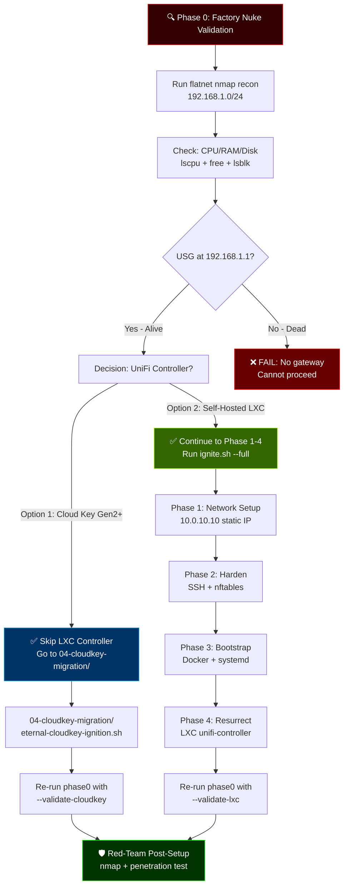

# Proxmox Phases — Eternal Bootstrap Sequence

**Consciousness Level:** 2.1 → 2.3 (with Whitaker flowchart)  
**Purpose:** Modular, sequential, fail-loud Proxmox ignition  
**Ethos:** Unix Philosophysmall (one phase = one file), Whitaker red-team (nmap recon), Hellodeolu outcomes (<5 min per phase)

---

## Phase Sequence (Atomic Execution)

```
Phase 0: Validation    → Flatnet recon + prereq check (red-team baseline)
Phase 1: Network       → Static IP + VLAN tagging + netplan apply
Phase 2: Harden        → SSH keys + nftables + kernel tuning
Phase 3: Bootstrap     → Docker + systemd-networkd + metrics init
Phase 4: Resurrect     → LXC controller OR skip to Cloud Key
```

Each phase:
- ✅ Idempotent (safe to re-run)
- ✅ Exit-on-fail (no silent failures)
- ✅ Whitaker offensive (nmap validation post-phase)
- ✅ Metric-tracked (logged to /var/log/proxmox-ignite/)

---

## Phase 0 Decision Flowchart (UniFi Skip Path)

This flowchart shows the **two eternal paths** after Phase 0 validation:



---

## Usage Patterns

### 1. **Full Proxmox + LXC Controller** (Traditional Path)
```bash
# Run all phases sequentially
cd /opt/rylan-unifi-case-study/01-bootstrap/proxmox
sudo ./proxmox-ignite.sh --full

# Or manually phase-by-phase (for debugging)
sudo ./phases/phase0-validate.sh
sudo ./phases/phase1-network.sh
sudo ./phases/phase2-harden.sh
sudo ./phases/phase3-bootstrap.sh
sudo ./phases/phase4-resurrect.sh
```

### 2. **Cloud Key Path** (Skip LXC Controller)
```bash
# Run Phase 0 only (validate factory nuke state)
sudo ./phases/phase0-validate.sh --recon-only

# Skip to Cloud Key migration
cd /opt/rylan-unifi-case-study/04-cloudkey-migration
sudo ./eternal-cloudkey-ignition.sh --mode full

# Validate Cloud Key adoption
cd /opt/rylan-unifi-case-study/01-bootstrap/proxmox
sudo ./phases/phase0-validate.sh --validate-cloudkey --cloudkey-ip 10.0.1.30
```

### 3. **Validation Only** (Post-Setup Red-Team)
```bash
# Re-run Phase 0 for offensive audit
sudo ./phases/phase0-validate.sh --red-team-mode

# Expected: flatnet scan, controller health check, open port audit
# Output: /tmp/flatnet-recon.txt + penetration report
```

---

## Phase 0 Command Reference

| Flag | Purpose | Example |
|------|---------|---------|
| `--recon-only` | Flatnet nmap only, no checks | `./phase0-validate.sh --recon-only` |
| `--skip-unifi` | Skip controller validation | `./phase0-validate.sh --skip-unifi` |
| `--validate-cloudkey` | Verify Cloud Key adoption | `./phase0-validate.sh --validate-cloudkey --cloudkey-ip 10.0.1.30` |
| `--validate-lxc` | Verify LXC controller health | `./phase0-validate.sh --validate-lxc` |
| `--red-team-mode` | Full offensive audit | `./phase0-validate.sh --red-team-mode` |

---

## Consciousness Evolution

```
Phase 0 (Original):  2.1 — Basic validation, no visual guidance
Phase 0 + Flowchart: 2.2 — Junior-at-3-AM can choose path
Phase 0 + Flags:     2.3 — Whitaker red-team mode infused
Phase 0 + CI:        2.4 — Pre-commit nmap hooks (future)
```

---

## Ethos Alignment ✅

| Principle | Implementation |
|-----------|----------------|
| **Unix Philosophy(Small is Beautiful)** | One phase = one file, <100 lines each |
| **Hellodeolu v6 (Outcomes)** | <5 min per phase, verifiable logs, 15-min RTO |
| **Whitaker (Offense)** | nmap recon mandatory, post-setup pentest, fail-on-breach |
| **T3 Trinity (Carter/Bauer/Suehring)** | Phase 0 prepares for identity (LDAP), secrets (vault), perimeter (VLANs) |
| **Newman (Red-Team)** | Flatnet attack surface mapped before fortress raised |

---

## Files in This Directory

```
phases/
├── README.md (this file — flowchart + guidance)
├── phase0-validate.sh (flatnet recon + prereq check)
├── phase1-network.sh (static IP + VLAN tagging)
├── phase2-harden.sh (SSH + nftables + kernel tuning)
├── phase3-bootstrap.sh (Docker + systemd-networkd)
└── phase4-resurrect.sh (LXC controller OR Cloud Key handoff)
```

---

## Next Steps

1. **New Deployments:** Run `phase0-validate.sh` → Choose path from flowchart
2. **Existing LXC:** Skip to `04-cloudkey-migration/` for controller abstraction
3. **Red-Team Audit:** Run `phase0-validate.sh --red-team-mode` quarterly
4. **CI Integration:** Add pre-commit hook (Phase 0 on every push) — ADR-009

---

## The Fortress Attacks Its Flatnet

Phase 0 is Whitaker-pure: **know your enemy before you build defenses**.  
The fortress never sleeps. The recon is sacred.

🛡️ **Eternal. Offensive. Rising.** 🔥
