# 05-network-migration — IaC Migration & Rollback

**Purpose**: Migrate network configuration from legacy to IaC-managed state.
**Estimated Time**: <5 minutes (full migration)
**Risk Level**: High (production network changes)

## Overview

This directory contains the migration orchestrator that:
1. Backs up current state
2. Applies new configuration
3. Validates with Bauer isolation tests
4. Rolls back on failure

## Files

| File | Purpose |
|------|---------|
| `migrate.sh` | Main migration orchestrator |
| `rollback.sh` | Emergency rollback script |
| `backups/` | Timestamped config backups |
| `configs/` | Staged JSON configs for API push |
| `scripts/` | Helper scripts (preview, diff, etc.) |

## Migration Decision Tree

```mermaid
flowchart TD
    Start([Migration Needed]) --> Backup[1. Create Backup<br>./backups/YYYYMMDD-HHMMSS/]
    
    Backup --> PreFlight{2. Pre-Flight Check}
    PreFlight -->|Fail| Abort[❌ Abort Migration<br>Review errors]
    PreFlight -->|Pass| Preview[3. Preview Changes<br>./scripts/preview-changes.sh]
    
    Preview --> Confirm{Confirm Changes?}
    Confirm -->|No| Abort
    Confirm -->|Yes| Apply[4. Apply Config<br>API push to controller]
    
    Apply --> Validate{5. Bauer Validation<br>nmap isolation tests}
    Validate -->|9/9 Pass| Done([✅ Migration Complete])
    Validate -->|Any Fail| Decision{Within RTO?}
    
    Decision -->|Yes| Rollback[./rollback.sh]
    Decision -->|No| Manual[Manual intervention<br>Check console]
    
    Rollback --> Verify{Rollback Success?}
    Verify -->|Yes| Stable([🔄 Reverted to Backup])
    Verify -->|No| Manual
    
    style Start fill:#036,stroke:#0af,color:#fff
    style Done fill:#030,stroke:#0f0,color:#fff
    style Abort fill:#630,stroke:#fa0,color:#fff
    style Rollback fill:#603,stroke:#f0a,color:#fff
    style Manual fill:#600,stroke:#f00,color:#fff
```



## Usage

### Full Migration (Production)

```bash
cd /opt/rylan-unifi-case-study

# 1. Ensure configs are ready
ls -la 02-declarative-config/vlans.yaml
ls -la 02-declarative-config/firewall-rules.yaml

# 2. Run migration
./05-network-migration/migrate.sh
```

**Expected output**:
```
════════════════════════════════════════════════════════════════
  NETWORK MIGRATION — IaC Fortress Transition
════════════════════════════════════════════════════════════════

[PHASE 1] Creating backup...
  ✓ Backup saved: backups/20251211-143022/

[PHASE 2] Pre-flight validation...
  ✓ Controller reachable (443/tcp)
  ✓ API authentication successful
  ✓ Current config exported

[PHASE 3] Previewing changes...
  VLANs: 2 additions, 0 modifications
  Firewall: 3 additions, 1 modification
  Continue? [y/N]: y

[PHASE 4] Applying configuration...
  ✓ VLANs applied
  ✓ Firewall rules applied
  ✓ Provisioning triggered

[PHASE 5] Bauer validation...
  ✓ VLAN isolation: 9/9 passed

MIGRATION COMPLETE — RTO: 3m 42s
```

### Preview Only (Dry Run)

```bash
./05-network-migration/scripts/preview-changes.sh
```

### Emergency Rollback

```bash
# Automatic (uses latest backup)
./05-network-migration/rollback.sh

# Specific backup
./05-network-migration/rollback.sh --backup backups/20251211-143022/
```

**Rollback RTO**: <2 minutes

## Pre-Flight Checklist

Before running migration:

- [ ] Backup created (`./backups/` has recent timestamp)
- [ ] YAML configs validated (`python3 -c "import yaml; yaml.safe_load(open('vlans.yaml'))"`)
- [ ] Controller accessible (`curl -k https://10.0.1.20:443`)
- [ ] Credentials in `.secrets/` or environment
- [ ] Rollback script tested (`./rollback.sh --dry-run`)
- [ ] Maintenance window scheduled

## Rollback Procedure

If migration fails and automatic rollback doesn't work:

1. SSH to controller: `ssh ubnt@10.0.1.20`
2. Locate backup: `ls /opt/unifi/data/autobackup/`
3. Restore manually: UniFi UI → Settings → Restore
4. Verify: `./scripts/validate-isolation.sh`

## Related

- [02-declarative-config/](../02-declarative-config/) — Source YAML configs
- [03-validation-ops/validate-isolation.sh](../03-validation-ops/validate-isolation.sh) — Post-migration validation
- [04-cloudkey-migration/](../04-cloudkey-migration/) — Controller migration (different from network migration)
