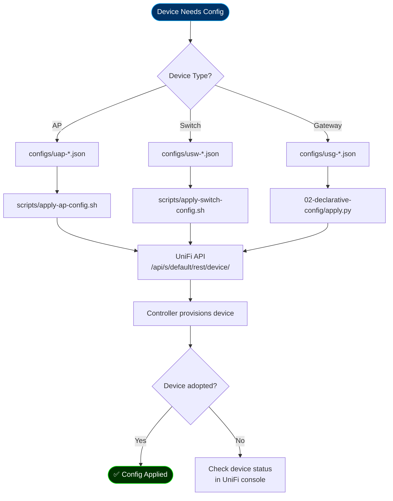

# 06-device-config — Device-Specific Configurations

**Purpose**: Per-device configuration templates and deployment scripts.
**Estimated Time**: <30 seconds per device
**Risk Level**: Medium (device changes)

## Overview

This directory contains device-specific configurations for:

- UniFi Access Points (UAP)
- UniFi Switches (USW)
- UniFi Security Gateway (USG)
- Other network devices

## Directory Structure

```text
06-device-config/
├── configs/           # JSON/YAML config templates
│   ├── uap-pro.json
│   ├── usw-lite-8.json
│   └── usg-3p.json
└── scripts/           # Deployment helpers
    ├── apply-ap-config.sh
    └── apply-switch-config.sh
```

## Device Configuration Flow



## Usage

### Apply AP Configuration

```bash
# Single AP
./06-device-config/scripts/apply-ap-config.sh --mac aa:bb:cc:dd:ee:ff

# All APs
./06-device-config/scripts/apply-ap-config.sh --all
```

### Apply Switch Configuration

```bash
# Single switch
./06-device-config/scripts/apply-switch-config.sh --mac 00:11:22:33:44:55

# By name
./06-device-config/scripts/apply-switch-config.sh --name "USW-Lite-8-PoE"
```

## Configuration Templates

### AP Template (uap-pro.json)

```json
{
  "radio_table": [
    {"radio": "ng", "channel": "auto", "tx_power_mode": "auto"},
    {"radio": "na", "channel": "auto", "tx_power_mode": "auto"}
  ],
  "led_override": "on",
  "mgmt_network_id": "vlan10"
}
```

### Switch Template (usw-lite-8.json)

```json
{
  "port_overrides": [
    {"port_idx": 1, "native_networkconf_id": "vlan10"},
    {"port_idx": 2, "native_networkconf_id": "vlan20"}
  ],
  "stp_priority": 32768
}
```

## Related

- [02-declarative-config/](../02-declarative-config/) — Network-wide configs
- [01-bootstrap/adopt-devices.py](../01-bootstrap/adopt-devices.py) — Device adoption
- [docs/DEVICE-PASSPORT-IMPLEMENTATION.md](../docs/DEVICE-PASSPORT-IMPLEMENTATION.md) — Passport system
