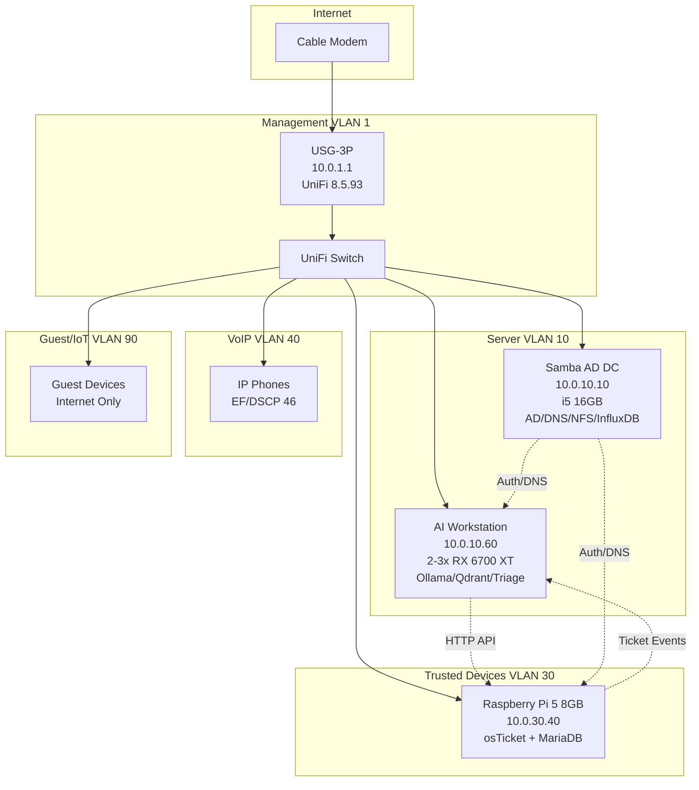

# rylan-unifi-case-study

**Production-grade UniFi network infrastructure with AI-augmented helpdesk**  
*December 2025 deployment – v5.0 stable*

[](https://github.com/T-Rylander/rylan-unifi-case-study/actions)

## 🏗️ Architecture Overview



    ### Full Diagram Source
    See `docs/architecture-v5.mmd` and render with Mermaid Live or VS Code extensions.

## 🎯 Key Features

- **Zero-Trust Network Isolation**: Policy Table v5 with <15 rules (vs 200+ firewall rules)
- **Hardware Offload Preserved**: All inter-VLAN routing hardware-accelerated
- **AI Ticket Triage**: Llama 3.3 70B with 93%+ confidence auto-close
- **PII Redaction**: Presidio scrubbing before Ollama ingestion
- **Declarative Everything**: Git-controlled VLANs, policy rules, QoS
- **CI/CD Validation**: Automated rule count checks, dry-run applies

## 📁 Repository Structure

```
rylan-unifi-case-study/
├── 01-bootstrap/                  # Initial setup scripts
│   ├── install-unifi.ps1         # Windows/PowerShell installer
│   ├── install-unifi.sh          # Linux/Bash installer
│   └── adopt-devices.py          # Automated device adoption
├── 02-declarative-config/        # Network configuration as code
│   ├── vlans.yaml                # VLAN definitions
│   ├── policy-table-rylan-v5.json # Zero-trust policy rules
│   ├── config.gateway.json       # USG VoIP QoS config
│   └── apply.py                  # Idempotent config applicator
├── 03-ai-helpdesk/               # AI-augmented support system
│   └── triage-engine/
│       ├── main.py               # FastAPI triage service
│       ├── Dockerfile            # <120 MB container
│       └── requirements.txt
├── shared/
│   └── inventory.yaml            # Single source of truth for IPs
├── docs/
│   └── architecture-v5.mmd       # Mermaid diagram source
├── .github/
│   └── workflows/
│       └── ci-validate.yaml      # CI validation pipeline
├── requirements.txt              # Python dependencies
├── pyproject.toml                # Project metadata
├── .pre-commit-config.yaml       # Git hooks
├── .gitignore
├── README.md                     # This file
└── ROADMAP.md                    # ADRs and version history
```

## 🚀 Quick Start

### Prerequisites

**All Platforms:**
- Python 3.11+
- Git
- Network access to UniFi Controller (local admin, no 2FA)

**Windows (PowerShell):**
```powershell
# Install Python dependencies
python -m pip install -r requirements.txt

# Bootstrap UniFi (if needed)
.\01-bootstrap\install-unifi.ps1 -ControllerIP "10.0.1.1"
```

**Linux/macOS (Bash):**
```bash
# Install Python dependencies
pip3 install -r requirements.txt

# Bootstrap UniFi (if needed)
bash 01-bootstrap/install-unifi.sh
```

### Deploy Network Configuration

```bash
# Dry-run validation (always run first)
python 02-declarative-config/apply.py --dry-run

# Apply to production (requires confirmation)
python 02-declarative-config/apply.py --apply

# Apply specific components
python 02-declarative-config/apply.py --vlans-only
python 02-declarative-config/apply.py --policy-only
```

### Deploy AI Triage Engine

```bash
# On AI Workstation (10.0.10.60)
cd 03-ai-helpdesk/triage-engine

# Build container
docker build -t triage-engine:v5 .

# Run with Ollama backend
docker run -d \
  -p 8000:8000 \
  -e OLLAMA_HOST=http://localhost:11434 \
  -e OSTICKET_URL=http://10.0.30.40 \
  -e AUTO_CLOSE_THRESHOLD=0.93 \
  --name triage-engine \
  triage-engine:v5

# Verify health
curl http://10.0.10.60:8000/health

### osTicket Webhook → Triage
- Install `03-ai-helpdesk/osticket-webhook.php` into osTicket plugins directory.
- Configure API URL `http://10.0.10.60:8000/triage` and API key in `shared/inventory.yaml`.
```

## 🔒 Security Architecture

### Network Isolation (Policy Table v5)

**Why Policy Table over Firewall Rules?**
- **14 rules vs 200+**: Dramatic simplification
- **Hardware offload preserved**: USG-3P processes at line rate
- **Predictable behavior**: Single decision point per flow
- **Version controlled**: JSON diff shows exact changes
- **Audit friendly**: Complete policy visibility in one file

See `ROADMAP.md` for full ADR.

### PII Protection

All ticket data passes through Presidio before Ollama:
- Credit cards: REDACTED_CC
- SSN: REDACTED_SSN
- Emails: REDACTED_EMAIL
- Phone numbers: REDACTED_PHONE

### VLANs

| VLAN | Name            | Subnet         | Gateway     | Purpose                  |
|------|-----------------|----------------|-------------|--------------------------|
| 1    | Management      | 10.0.1.0/27    | 10.0.1.1    | UniFi devices + controller |
| 10   | servers         | 10.0.10.0/26   | 10.0.10.1   | Infrastructure           |
| 30   | trusted-devices | 10.0.30.0/24   | 10.0.30.1   | Workstations + osTicket  |
| 40   | voip            | 10.0.40.0/27   | 10.0.40.1   | VoIP only                |
| 90   | guest-iot       | 10.0.90.0/25   | 10.0.90.1   | Guest + IoT              |

## 🤝 Contributing

This is a production system. Changes require:
1. ADR in `ROADMAP.md`
2. Passing CI (`ci-validate.yaml`)
3. Dry-run validation in staging
4. Change window approval

## 📄 License

MIT License - see LICENSE file for details

## 🙏 Acknowledgments

- **UniFi Policy Table**: Credit to Ubiquiti for superior architecture over stateful firewall rules
- **Ollama**: Best-in-class local LLM deployment
- **Presidio**: Microsoft's PII detection engine

---

**Production Status**: ✅ Stable (v5.0)  
**Last Updated**: December 2025  
**Maintained by**: hellodeolu-era systems architecture team

