# rylan-unifi-case-study  
**Production-Grade UniFi Network + AI-Augmented Helpdesk – v5.0 Stable**  
*December 2025 – Locked & Running in Production*  

[](https://github.com/T-Rylander/rylan-unifi-case-study/actions?branch=enlightenment-blueprint)

## 🏗️ Architecture Overview (v5.0)

```mermaid
graph TB
    subgraph Internet
        WAN[Cable Modem]
    end
    subgraph "Management VLAN 1"
        USG[USG-3P<br>10.0.1.1<br>UniFi 8.5.93]
        Switch[UniFi Switch Lite 8 PoE]
    end
    subgraph "Servers VLAN 10"
        ADDS[Samba AD/DC + DNS + NFS<br>rylan-dc<br>10.0.10.10]
        AIWork[AI Workstation<br>10.0.10.60<br>Ollama • Qdrant • Triage]
    end
    subgraph "Trusted Devices VLAN 30"
        RPi[Raspberry Pi 5<br>osTicket + MariaDB<br>10.0.30.40]
    end
    subgraph "VoIP VLAN 40"
        Phone[Grandstream Phones<br>EF/DSCP 46]
    end
    subgraph "Guest/IoT VLAN 90"
        Guest[Guests + Smart Devices<br>Internet-Only]
    end

    WAN --> USG
    USG --> Switch
    Switch --> ADDS
    Switch --> AIWork
    Switch --> RPi
    Switch --> Phone
    Switch --> Guest

    AIWork -.HTTP API.-> RPi
    RPi -.Webhook.-> AIWork
    ADDS -.AD/DNS/NFS.-> AIWork
    ADDS -.AD/DNS.-> RPi
```



Full source: `docs/architecture-v5.mmd`

## 🎯 Production VLAN Table (December 2025)

| VLAN | Name            | Subnet         | Gateway      | Purpose                     | Example IPs / Services                  |
|------|-----------------|----------------|--------------|-----------------------------|-----------------------------------------|
| 1    | Management      | 10.0.1.0/27    | 10.0.1.1     | UniFi devices + controller  | USG, APs, Controller (10.0.1.20)        |
| 10   | servers         | 10.0.10.0/26   | 10.0.10.1    | Infrastructure              | rylan-dc (10.0.10.10), AI WS (10.0.10.60)|
| 30   | trusted-devices | 10.0.30.0/24   | 10.0.30.1    | Workstations + osTicket     | osTicket Pi5 (10.0.30.40)               |
| 40   | voip            | 10.0.40.0/27   | 10.0.40.1    | VoIP only                   | FreePBX macvlan (10.0.40.30)            |
| 90   | guest-iot       | 10.0.90.0/25   | 10.0.90.1    | Guest + IoT                 | Guests, printers, bulbs                 |

## 🔒 Zero-Trust Implementation (USG-3P Compatible)

- Network Isolation toggle = ON (drops everything inter-VLAN in hardware)  
- Explicit allow rules in **Policy Table** → **8 rules total** (still <15 → hardware offload preserved)

Current policy table lives in `02-declarative-config/policy-table-rylan-v5.json`

## rylan-dc – The Eternal Multi-Role Server (No Extra Hardware)

| Role                            | IP            | VLAN | Interface / Notes                          |
|---------------------------------|---------------|------|--------------------------------------------|
| Samba AD/DC + DNS + NFS + Influx| 10.0.10.10    | 10   | Primary eno1                               |
| Lightweight PXE / proxyDHCP     | **10.0.30.10**| 30   | Sub-interface eno1 (no VLAN tag needed)    |
| UniFi Controller (legacy)       | 10.0.1.20     | 1    | Docker macvlan (inform on 8081)            |

→ PXE for laptops/thin-clients on VLAN 30 works with **one extra allow rule** (#8) and zero VLAN changes.

## 📁 Repository Structure

```
rylan-unifi-case-study/
├── 01-bootstrap/                  # Controller install + device adoption
├── 02-declarative-config/         # Git-controlled VLANs, Policy Table, QoS
│   ├── vlans.yaml
│   ├── policy-table-rylan-v5.json
│   ├── config.gateway.json        # VoIP EF marking
│   └── apply.py                   # Idempotent applicator
├── 03-ai-helpdesk/
│   └── triage-engine/             # FastAPI + Ollama + Presidio redaction
├── shared/
│   └── inventory.yaml             # Single source of truth IPs/keys
├── docs/
│   └── architecture-v5.mmd
├── .github/workflows/ci-validate.yaml
└── README.md                      # You are here
```

## 🚀 Quick Deploy (Post-Bootstrap)

```bash
git clone https://github.com/T-Rylander/rylan-unifi-case-study.git
cd rylan-unifi-case-study
python -m venv .venv && source .venv/bin/activate
pip install -e .

# Dry-run first – always
python 02-declarative-config/apply.py --dry-run

# Apply VLANs + Policy Table
python 02-declarative-config/apply.py --apply
```

## 🤖 AI Triage Engine (10.0.10.60)

```bash
cd 03-ai-helpdesk/triage-engine
docker build -t triage:v5 .
docker run -d --name triage -p 8000:8000 \
  -e OLLAMA_HOST=http://localhost:11434 \
  -e OSTICKET_URL=http://10.0.30.40 \
  triage:v5
```

Webhook plugin: copy `03-ai-helpdesk/osticket-webhook.php` into osTicket plugins dir.

## 🔧 Validation Commands (Run from rylan-dc)

```bash
# Isolation checks
bash 03-validation-ops/validate-isolation.sh

# AI → osTicket connectivity
curl -H "X-API-Key: $OSTICKET_KEY" http://10.0.30.40/api/tickets

# VoIP health
python 03-validation-ops/phone-reg-test.py
```

## 🎉 Status – December 2025

| Component              | Status | Notes                                   |
|------------------------|--------|-----------------------------------------|
| Zero-Trust Policy Table| ✅     | 8 rules, hardware offload intact        |
| AI Ticket Triage       | ✅     | 93 %+ confidence auto-close             |
| PII Redaction          | ✅     | Presidio before Ollama                 |
| Lightweight PXE (VLAN30)| ✅     | dnsmasq on 10.0.30.10 sub-interface     |
| Declarative Config     | 🟡     | VLANs automated, Policy/QoS still GUI   |
| CI/CD                  | ✅     | Rule count + dry-run checks             |

Branch: `enlightenment-blueprint` → ready to merge into `main` once final GUI steps are scripted.

**One PR away from eternal, junior-at-3-AM deployable infrastructure.**

Say the word and I’ll open it right now. 🟢
