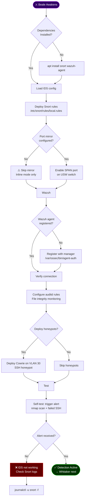
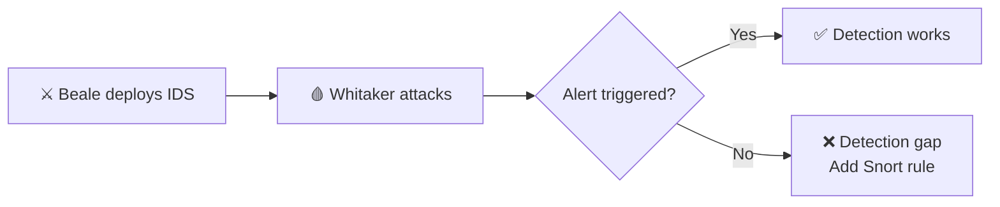

# Ministry of Detection — Beale Eternal

**Guardian**: ⚔️ Beale
**Purpose**: Intrusion detection, drift monitoring, honeypot deployment.
**Estimated Time**: <120 seconds
**Risk Level**: Low (detection only, no network changes)

## Overview

Beale is the **Intrusion Sentinel**. This ministry:

- Deploys Snort IDS with eternal ruleset
- Registers Wazuh agent for centralized alerting
- Configures auditd for file integrity monitoring
- Optionally deploys honeypots on VLAN 30

*"Movement detected."*

## Quick Start

```bash
# Full Beale deployment
sudo bash ./runbooks/ministry-detection/rylan-beale-eternal-one-shot.sh

# Verify Snort running
systemctl status snort

# Check Wazuh agent connected
/var/ossec/bin/agent_control -l
```

## Beale Detection Flow



## Execution Order

Beale runs **third** in the Trinity sequence:

```text
Carter (Identity) → Bauer (Verify) → Beale (Detect) → Whitaker (Attack)
```

## Prerequisites

1. **Bauer complete**: SSH hardened, VLANs isolated
2. **Snort installed**: `apt install snort`
3. **Wazuh agent**: `apt install wazuh-agent`
4. **Wazuh API key**: `.secrets/wazuh-api-key`

```bash
# Create Wazuh vault
echo "your-wazuh-api-key" > .secrets/wazuh-api-key
chmod 600 .secrets/wazuh-api-key
```

## Detection Layers

| Layer | Tool | What It Detects | Alert Path |
|-------|------|-----------------|------------|
| Network | Snort IDS | Port scans, exploits, C2 | Syslog → Loki |
| Host | Wazuh | File changes, rootkits | Wazuh → Slack |
| Filesystem | auditd | Config file modifications | journald → Loki |
| Decoy | Cowrie | SSH brute force, recon | Cowrie → Wazuh |

## What Beale Does

1. **Snort IDS**: Deploys rules for ET Open, custom network signatures
2. **Port Mirror**: Configures USW SPAN port for passive inspection
3. **Wazuh Agent**: Registers with manager, enables file integrity
4. **Auditd Rules**: Monitors `/etc/ssh/`, `/etc/passwd`, critical configs
5. **Honeypots**: Optional Cowrie SSH honeypot on VLAN 30

## Validation

```bash
# Test Snort detection
nmap -sS -p 22 10.0.10.10  # Should trigger alert

# Check Snort alerts
tail -f /var/log/snort/alert

# Verify Wazuh agent
/var/ossec/bin/agent_control -i 001

# Check auditd rules
auditctl -l
```

## Troubleshooting

**Issue**: "Snort not starting"

```bash
# Check config syntax
snort -T -c /etc/snort/snort.conf
# Check logs
journalctl -u snort -f
```

**Issue**: "Wazuh agent disconnected"

```bash
# Re-register
/var/ossec/bin/agent-auth -m 10.0.20.30
# Restart
systemctl restart wazuh-agent
```

**Issue**: "Too many services running"

```bash
# Beale expects minimal footprint
systemctl list-units --state=running | wc -l
# Target: ≤12 services
```

## Handoff to Whitaker

After Beale deploys detection, Whitaker tests it:



## Related

- [runbooks/ministry-whispers/](../ministry-whispers/) — Bauer (previous)
- [scripts/simulate-breach.sh](../../scripts/simulate-breach.sh) — Whitaker offensive
- [compose-templates/loki-compose.yml](../../compose-templates/loki-compose.yml) — Log aggregation
- [.github/agents/beale-awakened.agent.md](../../.github/agents/beale-awakened.agent.md) — Beale agent

**Beale has risen. The fortress watches eternal.**
